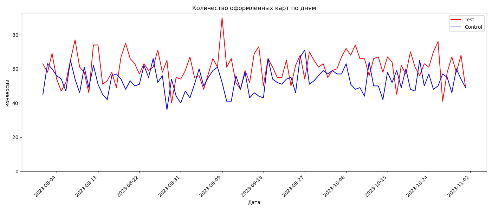
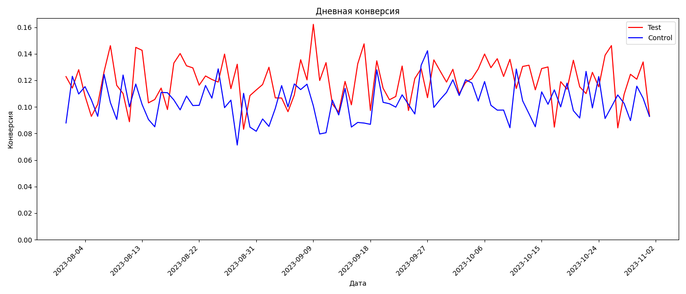
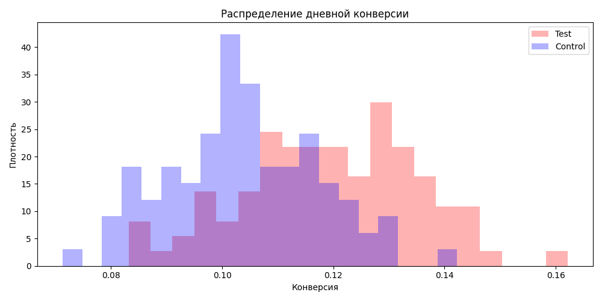

Полное задание и решение кодом - https://colab.research.google.com/drive/1R0fI5YoW9cZ3Nkbvbb9heZpUfaQUCPDf?usp=sharing

# ab-test-analysis
a/b тест тестовых данных T-банка

# A/B-тест: влияние информации о партнёрских кэшбеках на конверсию в оформление дебетовой карты

## 📌 Описание эксперимента

- **Цель:** увеличить конверсию из посетителей лендинга в оформление дебетовой карты Tinkoff Black.
- **Изменение:** на лендинг добавлен блок с информацией о дополнительных кэшбеках от партнёров.
- **Метрика:** конверсия в оформление карты (conversion rate) = количество оформленных карт / количество посетителей лендинга.
- **Дизайн:** рандомизированное разбиение пользователей на контрольную (`control`) и тестовую (`test`) группы в пропорции ~50/50.
- **Данные:** ежедневные логи за период с 2023-08-01 по ... (см. `hw_ab.csv`).

## 🔬 Методология

Анализ выполняется автоматически при каждом обновлении данных (GitHub Actions). Используются:

1. **Проверка качества данных:** уникальность пользователей, балансировка групп, отсутствие пропусков дней.
2. **Общие конверсии** и относительный прирост (lift).
3. **Биномиальный тест** (точный тест для пропорций) — проверка гипотезы о равенстве конверсий.
4. **t-тест для дневных конверсий** — проверка устойчивости различий на агрегированных по дням данных (ЦПТ).
5. **Визуализация динамики и распределений.**

Результаты каждого этапа сохраняются в `output.txt` и в виде графиков в папке `plots/`.

## 📊 Результаты (автоматически сгенерированы)

### 1. Качество данных и балансировка

**Вывод из `output.txt` и кода Colab:**

- Уникальны ли пользователи? (Сколько уникальных `id` / всего строк?)
Да, все пользователи уникальны. Всего строк: 94778, уникальных id: 94778. Дубликаты отсутствуют.

- Равное ли количество людей в группах?
Да, группы сбалансированы. Соотношение: Test — 47448 пользователей, Control — 47330 пользователей (разница менее 0.25%, что не влияет на баланс).

- Нет ли пропусков дней?
Тест длился 93 дня (август–ноябрь 2023). Период непрерывный, пропуски дат отсутствуют.

Итог:
Данные полностью пригодны для анализа. Пользователи уникальны, группы сбалансированы, тест проведён непрерывно на протяжении трёх месяцев. Это обеспечивает надёжность статистических выводов.
  
- **Итог:** Данные полностью пригодны для анализа. Пользователи уникальны, группы сбалансированы, тест проведён непрерывно на протяжении трёх месяцев. Это обеспечивает надёжность статистических выводов.

### 2. Общие конверсии и относительный прирост

**Результаты из ячейки 5 в Colab:**

- Конверсия в контроле: **10.40%**
- Конверсия в тесте: **11.96%**
- Относительный прирост (lift): **+14.99%**

**Интерпретация для бизнеса:**
Относительный прирост конверсии в +15% — это отличный показатель. При среднем дневном трафике ~1 019 посетителей абсолютная разница в конверсии (1.56 п.п.) означает ~16 дополнительных оформлений карт в день или ~477 карт в месяц. Такой эффект напрямую увеличивает выручку компании. Рекомендация: тест однозначно стоит раскатать на 100% пользователей.

### 3. Биномиальный тест p-value = 0,00000

- **p-значение:** **0,00000**

**Вывод:** p < 0.05  Поскольку мы получили большой положительный сдвиг (+744 карты) и p-value < 0.05, мы имеем все основания одобрить раскатку теста на всех пользователей. Если бы разница была +0 или -20, мы бы такого сделать не могли. Нулевая гипотеза (о том, что конверсии в тесте и контроле равны) отвергается.

### 4. Динамика и распределения (графики)

**Количество оформлений по дням:**
На графике видно, что красная линия (Test) почти на всем протяжении периода (август–ноябрь) располагается выше синей линии (Control). Наиболее заметный пик оформлений зафиксирован 10 сентября (около 90 карт в тестовой группе). Несмотря на естественные колебания (выходные, праздники, акции), тестовая версия стабильно превосходит контрольную. Это визуальное подтверждение того, что добавленная информация о кэшбеках работает.

**Дневная конверсия:**  
Здесь наблюдается та же картина: красная линия (Test) систематически выше синей (Control). Пики конверсии в тесте достигают 16%, в то время как у контроля редко превышают 14%. Это означает, что тест обеспечивает более высокий процент оформлений от всех посетителей лендинга.

**Распределение дневной конверсии:**
Гистограмма показывает, как распределяются дни по уровню конверсии. Синий пик (Control) сконцентрирован на уровне ~10%, а красный пик (Test) смещён вправо, в зону ~12–13%. У теста есть заметный «хвост» вправо, доходящий до 16%, в то время как у контроля он обрывается раньше. Это означает, что тестовая группа чаще попадает в категорию с более высокой конверсией.

**Распределение дневного числа конверсий:**
Здесь наблюдается та же закономерность. Синий пик (Control) находится на уровне ~55 карт в день, тогда как красный пик (Test) смещён вправо и достигает ~66–67 карт в день. Кроме того, у теста есть длинный «хвост» в диапазоне 70–90 карт в день, которого у контроля почти нет. Это говорит о том, что тест не просто немного лучше, а способен на значительно более высокие результаты в удачные дни.

 и преимущество на линейных графиках на протяжении всего периода. Это полностью согласуется с результатами статистических тестов (p-value < 0.05) и подтверждает, что добавление информации о кэшбеках действительно повышает конверсию.

### 5. t-тест для дневных конверсий (p-value = ...)

- **p-значение (из ячейки с `ttest_ind`):** **[ВСТАВЬТЕ ВАШЕ ЗНАЧЕНИЕ]**

[ВСТАВЬТЕ ВАШ ТЕКСТ СЮДА] (Согласуется ли результат с биномиальным тестом? Если да, напишите: «Результат согласован, вывод робастный.» Если нет, объясните разницу.)

### 6. t-тест для дневного количества конверсий (p-value = ...)

- **p-значение (из ячейки с `ttest_ind`):** **[ВСТАВЬТЕ ВАШЕ ЗНАЧЕНИЕ]**

[ВСТАВЬТЕ ВАШ ТЕКСТ СЮДА] (Хотя этот тест менее корректен, чем биномиальный, он подтверждает / не подтверждает, что тест даёт больше оформлений в день.)

## 🧠 Экспертное заключение

Объединяя все этапы, я делаю следующий вывод:

> [ВСТАВЬТЕ СЮДА ВАШ ИТОГОВЫЙ ВЫВОД]

**Примерная структура:**
1. Визуально на графиках: красная линия (тест) в большинстве дней выше синей (контроль), гистограммы показывают сдвиг теста вправо.
2. Статистически: биномиальный тест показал p-value = X, что < 0.05 → различие статистически значимо.
3. Практически: прирост конверсии составил Y% (lift). При текущем трафике это даёт ~Z дополнительных карт в день.
4. **Вывод:** Тест работает эффективно.

## 🚦 Рекомендация по раскатке

- [ ] **Раскатить** тестовую версию на 100% пользователей
- [ ] **Не раскатывать**, продолжить наблюдение
- [ ] **Повторить тест** с увеличенной выборкой или длительностью

**Обоснование (мои причины):**

> [ВСТАВЬТЕ СЮДА ВАШУ АРГУМЕНТАЦИЮ]

*Подсказка: Взвесьте статистическую значимость (p < 0.05) и практический эффект (lift). Подумайте о рисках, например, может ли тест плохо работать на каких‑то сегментах? Оцените затраты на внедрение.*

## 🔮 Дальнейшие шаги и улучшения

- **Сегментный анализ:** проверить, как эффект различается по типу устройств, источникам трафика, гео.
- **Анализ чувствительности:** пересчитать тест с поправкой на множественное тестирование, если в будущем будет несколько метрик.
- **Мониторинг после раскатки:** отслеживать конверсию и, возможно, побочные метрики (отказы, вовлечённость, стоимость привлечения).
- **A/B-тест на удержание:** если карта оформляется, но не активируется – не наш ли это эффект?

## 🛠 Техническая реализация

Анализ полностью автоматизирован и воспроизводим.  
При каждом обновлении данных (push в main) запускается скрипт `analysis.py` (GitHub Actions), который вычисляет метрики и сохраняет текстовый отчёт `output.txt` и графики в `plots/`.

**Стек:** Python, pandas, scipy, matplotlib, seaborn.

## 📂 Файлы

- `hw_ab.csv` – исходные данные (если файл назван иначе, скорректировать `analysis.py`)
- `analysis.py` – код автоматического анализа
- `output.txt` – текстовые результаты (обновляется авто)
- `plots/` – графики (обновляются авто)
- `.github/workflows/run-analysis.yml` – настройка CI/CD

---

*Аналитик: [ваше имя]  
Дата последнего обновления: ...*
