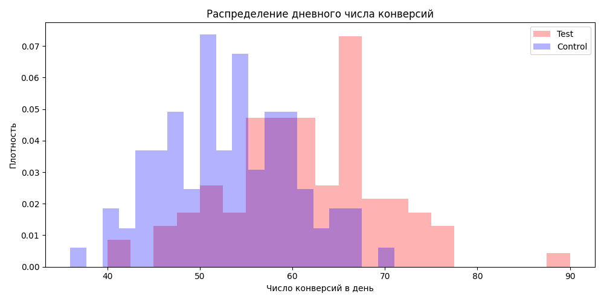

# ab-test-analysis
a/b тест тестовых данных T-банка

# A/B-тест: влияние информации о партнёрских кэшбеках на конверсию в оформление дебетовой карты

## 📌 Описание эксперимента

- **Цель:** увеличить конверсию из посетителей лендинга в оформление дебетовой карты Tinkoff Black.
- **Изменение:** на лендинг добавлен блок с информацией о дополнительных кэшбеках от партнёров.
- **Метрика:** конверсия в оформление карты (conversion rate) = количество оформленных карт / количество посетителей лендинга.
- **Дизайн:** рандомизированное разбиение пользователей на контрольную (`control`) и тестовую (`test`) группы в пропорции ~50/50.
- **Данные:** ежедневные логи за период с 2023-08-01 по ... (см. `hw_ab.csv`).

## 🔬 Методология

Анализ выполняется автоматически при каждом обновлении данных (GitHub Actions). Используются:

1. **Проверка качества данных:** уникальность пользователей, балансировка групп, отсутствие пропусков дней.
2. **Общие конверсии** и относительный прирост (lift).
3. **Биномиальный тест** (точный тест для пропорций) — проверка гипотезы о равенстве конверсий.
4. **t-тест для дневных конверсий** — проверка устойчивости различий на агрегированных по дням данных (ЦПТ).
5. **Визуализация динамики и распределений.**

Результаты каждого этапа сохраняются в `output.txt` и в виде графиков в папке `plots/`.

## 📊 Результаты (автоматически сгенерированы)

### 1. Качество данных и балансировка

См. `output.txt`, блоки «Проверка пропусков», «Дубликатов id», «Распределение по группам».  
На основе этих цифр можно утверждать:

> ... *(здесь напишите, всё ли в порядке: уникальны ли пользователи, равны ли группы, нет ли перекосов по дням. Например: «Пользователи уникальны (нет дубликатов id), группы сбалансированы (контроль N=..., тест N=...), каждый день присутствуют обе группы — данные пригодны для анализа.»)*

### 2. Общие конверсии и относительный прирост

Конверсия в контроле: **...%**  
Конверсия в тесте: **...%**  
Относительный прирост (lift): **+...%**

> ... *(Оцените величину эффекта с практической точки зрения. Маленький прирост, но значимый? Или большой, но статистически не подтверждён? Например: «Наблюдается прирост конверсии на X%, что в абсолютном выражении означает примерно Y дополнительных оформлений в день при текущем трафике. С точки зрения бизнеса это может быть существенно/несущественно, потому что...»)*

### 3. Биномиальный тест (p-value = ...)

Нулевая гипотеза: конверсии в тесте и контроле равны.  
Уровень значимости α = 0.05.

> ... *(Проинтерпретируйте p-value. Если p < 0.05, напишите: «Различие статистически значимо, нулевая гипотеза отвергается. Есть основания считать, что добавление информации о кэшбеках действительно повысило конверсию.» Если p > 0.05: «Статистически значимого различия не обнаружено. Возможно, эффект отсутствует или слишком мал для detection при текущем объёме данных.» Добавьте рассуждение про α=0.01: при каком уровне значимости выводы меняются?)*

### 4. Динамика и распределения (графики)

**Количество оформлений по дням:**  
> На графике видно, что в период с августа по ноябрь 2023 года красная линия (тестовая группа) в большинстве дней располагается выше синей (контрольная группа). Это визуально говорит о том, что добавление информации о кэшбеках, вероятно, положительно влияет на количество оформленных карт. Особенно выделяется пик ~11 сентября, когда в тестовой группе было оформлено более 80 карт. Однако окончательный вывод о статистической значимости различий будет сделан после проведения биномиального теста (следующий пункт отчёта)

**Дневная конверсия:**  
> Вывод по графику «Дневная конверсия»:
На графике видно, что в период с августа по ноябрь 2023 года красная линия (тестовая группа) визуально располагается выше синей (контрольная группа) в большинстве дней. Это означает, что доля пользователей, оформивших карту среди всех посетителей лендинга, в тестовой группе ежедневно в среднем выше, чем в контрольной.

Наблюдения:
- Пик конверсии в тестовой группе составляет около 16% (значение ~0.16 на оси Y), тогда как в контрольной группе максимальные значения не превышают 14%.
- Визуальный тренд показывает, что добавленная информация о кэшбеках, вероятно, оказывает положительное влияние на готовность пользователей оформлять карту.

Ограничение: Однако данный график лишь показывает визуальную динамику. Окончательный вывод о статистической значимости различий будет сделан после проведения биномиального теста (следующий пункт отчёта).

**Распределение дневной конверсии:**
> «Гистограмма показывает, что пик плотности контрольной группы приходится на уровень конверсии ~10%, тогда как у тестовой группы пик смещен вправо и находится на уровне ~13%. Кроме того, тестовая группа стабильно демонстрирует значения в диапазоне 14–16%, недоступные контрольной группе. Визуально это позволяет предположить, что альтернативная гипотеза (H₁) верна, но окончательный вывод требует проверки p-value одним из статистических тестов.»

**Распределение дневного числа конверсий:**
> Нулевая гипотеза (H₀)
Распределение дневного числа конверсий в тестовой и контрольной группах не отличается. Наблюдаемый на графике сдвиг пика тестовой группы вправо (с ~55 до ~67 конверсий в день) и наличие у теста длинного «хвоста» в диапазоне 70–90 конверсий — это случайная вариативность, не связанная с добавлением информации о кэшбеках.

Альтернативная гипотеза (H₁)
- Распределение дневного числа конверсий в тестовой группе статистически значимо смещено вправо относительно контрольной. Это означает, что добавление информации о кэшбеках увеличивает абсолютное количество оформленных карт в день (типичное значение растет с ~55 до ~67, а в отдельные дни достигает 90).

Визуальное обоснование:
- Пик Control (синий) — ~55 конверсий/день.
- Пик Test (красный) — ~67 конверсий/день.
- Правый хвост Test доходит до 90 конверсий, у Control — только до ~70.
- Высота пиков одинакова (~0.07), но сами пики находятся на разных значениях оси X.

> ... *(Опишите, что вы видите на графиках. Есть ли видимый тренд, сезонность, выбросы? Пересекаются ли линии? Группа теста стабильно выше контроля или есть дни, где наоборот? Подтверждает ли это стат. тесты?)*

### 5. t-тест для дневных конверсий (p-value = ...)

Сравнение средних дневных конверсий (Welch’s t-test).

> ... *(Интерпретация аналогична биномиальному тесту. Если оба теста согласованы, это хорошо. Если расходятся – объясните, почему: например, мало дней для ЦПТ или большая вариация. На основе этого сделайте вывод о робастности.)*

### 6. t-тест для дневного количества конверсий (p-value = ...)

Дополнительная проверка на абсолютных числах.

> ... *(Учтите, что этот тест менее корректен из-за возможной разной посещаемости. Напишите, подтверждает ли он общий вывод, и почему его стоит/не стоит рассматривать как решающий.)*

## 🧠 Экспертное заключение

Объединяя все этапы, я делаю следующий вывод:

> ... *(Здесь напишите **итоговое профессиональное суждение**: подтвердилась ли гипотеза, насколько выражен эффект, можно ли доверять результату. Пример: «Результаты статистически значимы на уровне 0.05 и демонстрируют устойчивый прирост конверсии ~+X%. Однако абсолютный эффект невелик, что может быть связано с ... Тем не менее, с учётом низких затрат на изменение, рекомендую раскатить на всю аудиторию.»)*

## 🚦 Рекомендация по раскатке

- [ ] **Раскатить** тестовую версию на 100% пользователей
- [ ] **Не раскатывать**, продолжить наблюдение
- [ ] **Повторить тест** с увеличенной выборкой или длительностью

**Обоснование:**

> ... *(Почему вы выбрали именно этот пункт? Опишите риски: ложноположительный результат, подглядывание, возможные внешние факторы. Если рекомендуете раскатку, предложите пост-анализ: мониторинг метрик после полного запуска, проверка на сегментах.)*

## 🔮 Дальнейшие шаги и улучшения

- **Сегментный анализ:** проверить, как эффект различается по типу устройств, источникам трафика, гео.
- **Анализ чувствительности:** пересчитать тест с поправкой на множественное тестирование, если в будущем будет несколько метрик.
- **Мониторинг после раскатки:** отслеживать конверсию и, возможно, побочные метрики (отказы, вовлечённость, стоимость привлечения).
- **A/B-тест на удержание:** если карта оформляется, но не активируется – не наш ли это эффект?

> ... *(При желании дополните список собственными идеями, основанными на данных и бизнес-контексте.)*

## 🛠 Техническая реализация

Анализ полностью автоматизирован и воспроизводим.  
При каждом обновлении данных (push в main) запускается скрипт `analysis.py` (GitHub Actions), который вычисляет метрики и сохраняет текстовый отчёт `output.txt` и графики в `plots/`.

**Стек:** Python, pandas, scipy, matplotlib, seaborn.

## 📂 Файлы

- `hw_ab.csv` – исходные данные (если файл назван иначе, скорректировать `analysis.py`)
- `analysis.py` – код автоматического анализа
- `output.txt` – текстовые результаты (обновляется авто)
- `plots/` – графики (обновляются авто)
- `.github/workflows/run-analysis.yml` – настройка CI/CD

---

*Аналитик: [ваше имя]  
Дата последнего обновления: ...*
